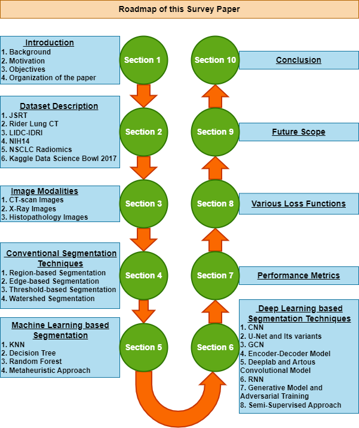

# <p align=center>`Awesome Lung Cancer Segmentation in Medical Imaging`</p>


[](https://github.com/iabh1shekbasu/awesome-lung-cancer-segmentation-medical-imaging/commits/main) 
[](https://github.com/sindresorhus/awesome)
[]()

This repository originates from our survey paper "**[From Pixels to Prognosis: A Comprehensive Review of Classical and Modern Approaches of Lung Nodule Segmentation for Improved Lung Cancer Diagnosis]()**" and authors (**[Arup Sau](https://scholar.google.co.in/citations?user=z_4j5sYAAAAJ&hl)**, **[Nandita Gautam](https://scholar.google.co.in/citations?user=bboVe7gAAAAJ&hl)**, **[Abhishek Basu](https://scholar.google.co.in/citations?user=SG3BWMoAAAAJ)**, **[Ram Sarkar](https://scholar.google.co.in/citations?user=bDj0BUEAAAAJ)**) will continue to update this over time.


> **Abstract:** *Lung cancer is a pervasive and life-threatening disease that requires timely detection and treatment for improved patient outcomes. Recent advancements in image processing and deep learning techniques have opened new avenues for identifying cancer in medical images. We examine these studies across various dimensions, encompassing input data (such as data modality, preprocessing techniques, and synthetic data generation), model design (including architecture, modules, and loss functions), and evaluation aspects (covering data annotation requirements and segmentation performance). Our analysis considers mostly the recently proposed methods and adopts a systematic viewpoint to understand the impact of these choices on current trends, and identifies areas (i.e., research gaps), where future researchers can work. To facilitate easy reference and comparison, we have comprehensively summarized the key findings of the existing methodologies.*

<div align="center">
    
    <p>Overview of the methods discussed in our paper. </p>
</div>

This repository contains a collection of state-of-the-art segmentation methods for lung cancer segmentation. 

If you find our work useful. Please consider giving a star :star: and a citation.
```bibtex
@article{,
  title={From Pixels to Prognosis: A Comprehensive Review of Classical and Modern Approaches of Lung Nodule Segmentation for Improved Lung Cancer Diagnosis},
  author={Sau, Arup and Gautam, Nandita and Basu, Abhishek and Sarkar, Ram},
  year={2024},
  publisher={}
}
```

In this repository, we have gathered some of the most promising lung cancer segmentation approaches for medical imaging and organized them based on their publication year. Whether you are new to lung cancer segmentation in medical imaging or an experienced researcher in the field, we hope that this repository will serve as a valuable resource for exploring the latest advances in this exciting area of research.


**Let's collaborate and enrich this list together! Reach out to [me](http://iabh1shekbasu.github.io/) or submit a [pull request](https://github.com/iabh1shekbasu/awesome-lung-cancer-segmentation-medical-imaging/pulls). Your contributions are highly appreciated.**


### Contents
- [Surveys](#Surveys)

#  Surveys

# *2024*

- **Title** (2024)<br>
Conference/Journal 2024* <br>
authors <br>
[[Paper]]()

# *2023*

# *2022*


